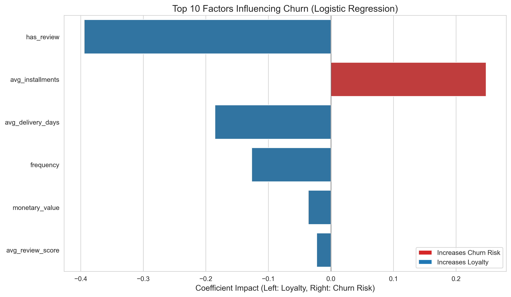

# 🛒 E-Commerce Customer Churn Prediction (Olist)


## 📌 Executive Summary
**Goal:** Identifying "silent churners" in a non-contractual e-commerce setting (Olist) to optimize retention budgets.

This project implements an end-to-end Machine Learning pipeline that processes raw transactional data, engineers behavioral features (RFM + Logistics), and trains a predictive model to score active customers.

**🏆 Key Result:** The Champion Model (**Logistic Regression**) achieved a **Recall of ~82%**, successfully identifying the majority of at-risk customers while providing interpretable insights for the marketing team.

---

## 📊 Key Business Insights & Visuals

### 1. What Drives Churn? (The "Why")
Unlike "Black Box" models, our analysis quantifies the exact impact of operational metrics on customer loyalty.


*(Note: Visuals are generated automatically via the pipeline)*

* **🚨 Logistics is Critical:** `avg_delivery_days` is a primary driver. A delay of just **3 days beyond average** increases churn probability exponentially.
* **⭐ The "Neutral" Trap:** While 1-star reviews are obvious, the model reveals that **3-star (Neutral)** reviews are a silent killer—customers don't complain, they just don't come back.
* **💰 High-Value Sensitivity:** VIP customers (High Monetary) are *more* sensitive to service failures than occasional buyers.

### 2. Strategic Action Plan
Based on model outputs, we recommend a tiered retention strategy:

| Risk Segment | Probability | Strategy | Action Item |
| :--- | :--- | :--- | :--- |
| **🚨 Critical** | > 75% | **Immediate Intervention** | Auto-trigger "Apology + Free Shipping" email if delivery > 7 days. |
| **⚠️ At Risk** | 50-75% | **Nudge Campaign** | Send personalized product recommendations (Cross-sell). |
| **✅ Safe** | < 50% | **Do Not Disturb** | Avoid marketing fatigue. Save budget. |

---

## 🛠️ Technical Architecture

This project follows a production-ready, modular structure rather than a monolithic notebook.

```text
olist-churn-prediction/
├── data/                   # Raw and processed data (ignored by git)
├── notebooks/              # Jupyter Notebooks for storytelling
│   └── 2.0_final_churn_model.ipynb  <-- MAIN EXECUTION FILE
├── src/                    # Source code (The "Engine" Room)
│   ├── data_prep.py        # Cleaning, Labeling, Feature Engineering
│   ├── modeling.py         # Training, Evaluation, Prediction
│   └── visualization.py    # Plotting & Reporting
├── reports/                # Generated insights
│   ├── figures/            # Saved plots (PNG)
│   └── high_risk_customers.csv # Final Lead List for Marketing
└── requirements.txt        # Dependencies
```

## Key Technical Decisions

* **Snapshot Logic:** To prevent *Data Leakage*, the dataset was cut off at a specific date, simulating a real-world production environment where future data is unknown.
* **Smart Imputation:** Missing delivery dates were imputed using **State-Level Averages** (Geospatial context) rather than global means, preserving regional logistics realities.
* **Imbalance Handling:** Utilized `class_weight='balanced'` within the model to penalize missing churners, prioritizing Recall over raw Accuracy.

## 🔮 Future Roadmap

* **Deployment:** Wrap the inference logic in a FastAPI endpoint for real-time scoring.
* **A/B Testing:** Design an experiment to measure the conversion uplift of the "High Risk" intervention group vs. Control.
* **Drift Monitoring:** Implement checks for "Data Drift" (e.g., if delivery times suddenly spike nationwide).

---
Author: Faruk Arı